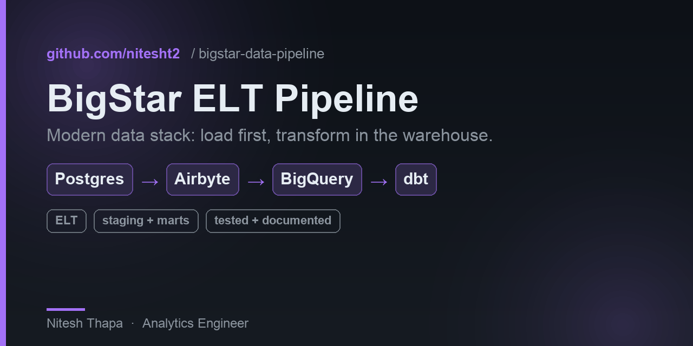
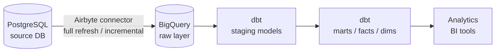

<p align="center">
  
</p>

# BigStar ELT Data Pipeline

**An end-to-end ELT pipeline that moves data from PostgreSQL through Airbyte into BigQuery, then transforms it with dbt** — demonstrating a modern data stack pattern used in production analytics engineering.


---

## Architecture



**Flow:** Airbyte syncs tables from PostgreSQL into BigQuery's raw layer → dbt staging models clean and standardize the raw data → dbt mart models build business-ready facts and dimensions → BI tools query the marts directly.

This follows the **ELT pattern** (Extract, Load, Transform): raw data lands in the warehouse first, transformation happens inside BigQuery using SQL rather than before loading.

---

## Stack

| Layer | Tool | Purpose |
|-------|------|---------|
| **Source** | PostgreSQL | Operational data store |
| **Ingestion** | Airbyte | Managed EL with schema evolution, CDC support |
| **Warehouse** | BigQuery | Analytical storage and compute |
| **Transformation** | dbt | SQL-based modeling, testing, documentation |

---

## Project structure

```
models/
├── staging/
│   ├── sources.yml         # raw Airbyte tables + freshness checks
│   ├── stg_customers.sql   # 1:1 clean of raw.customers
│   ├── stg_orders.sql      # 1:1 clean of raw.orders
│   └── schema.yml          # tests + column docs (unique, not_null, relationships, accepted_values)
├── marts/
│   ├── dims/
│   │   └── dim_customers.sql   # customer + lifetime order metrics
│   ├── facts/
│   │   └── fct_orders.sql      # order-grain fact, incremental (merge)
│   └── schema.yml
dbt_project.yml          # dbt project config
packages.yml             # dbt_utils dependency
profiles.yml.example     # BigQuery connection template
```

> The models are the **transformation layer**. They run on top of the `raw`
> dataset that Airbyte lands in BigQuery — point `sources.yml` at your raw
> tables (or any equivalent `customers` / `orders` tables) and `dbt build`.

---

## Key dbt patterns used

- **Staging models** — rename columns to snake_case, cast types, filter soft-deleted rows
- **Incremental models** — `{{ is_incremental() }}` to process only new/changed rows on refresh
- **Sources** — `sources.yml` declaring Airbyte-loaded raw tables with freshness checks
- **Tests** — `not_null`, `unique`, `accepted_values` on primary keys and foreign keys
- **Documentation** — `schema.yml` with column-level descriptions surfaced in dbt docs

---

## How to run

### Prerequisites

- PostgreSQL source database
- Airbyte instance (Cloud or self-hosted)
- BigQuery project with a service account
- dbt CLI (`pip install dbt-bigquery`)

### Setup

```bash
git clone https://github.com/nitesht2/bigstar-data-pipeline.git
cd bigstar-data-pipeline

# Configure BigQuery connection
cp profiles.yml.example ~/.dbt/profiles.yml
# Edit profiles.yml with your project ID and service account path
```

### Airbyte sync

1. Create a new Airbyte connection: PostgreSQL → BigQuery
2. Select tables to sync
3. Choose sync mode (Full Refresh or Incremental + Deduped)
4. Run the sync — raw tables appear in your BigQuery `raw` dataset

### dbt run

```bash
# Install dependencies
dbt deps

# Run all models
dbt run

# Run tests
dbt test

# Generate and serve docs
dbt docs generate && dbt docs serve
```

---

## Why ELT over ETL

Traditional ETL transforms data before loading — meaning you lose raw history and can't re-run transformations on the original data. ELT keeps the raw layer intact in BigQuery, so:

- Re-run dbt models any time without re-ingesting
- Audit trail from raw → staging → mart
- Warehouse compute (BigQuery) is cheaper than external transform servers at scale
- Schema changes in source are handled by Airbyte, not custom code

---

## License

MIT
